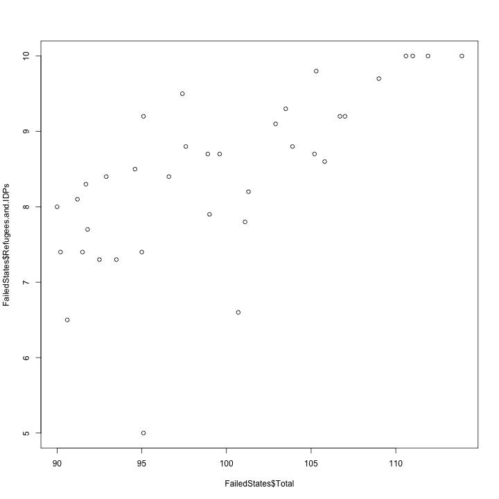

Summary and Plot of the SWISS standard dataset
========================================================

This is an R Markdown document. Markdown is a simple formatting syntax for authoring web pages (click the **Help** toolbar button for more details on using R Markdown).

When you click the **Knit HTML** button a web page will be generated that includes both content as well as the output of any embedded R code chunks within the document. You can embed an R code chunk like this:


### The Fund for Peace Failed States Index 2013


```r
ffpfsi13 <- read.csv("~/Desktop/ffpfsi13.csv", sep=";", dec=",")
summary(ffpfsi13)
```

```
##        X            Failed.States.Index.2013     Total       
##  = 67   :  3   Afghanistan      :  1         Min.   : 18.00  
##  = 83   :  3   Albania          :  1         1st Qu.: 54.48  
##  = 121  :  2   Algeria          :  1         Median : 75.20  
##  = 145  :  2   Angola           :  1         Mean   : 70.49  
##  = 161  :  2   Antigua & Barbuda:  1         3rd Qu.: 86.53  
##  = 166  :  2   Argentina        :  1         Max.   :113.90  
##  (Other):164   (Other)          :172                         
##  Demographic.Pressures Refugees.and.IDPs Group.Grievance   Human.Flight 
##  Min.   : 1.600        Min.   : 1.100    Min.   : 1.000   Min.   :1.00  
##  1st Qu.: 4.400        1st Qu.: 3.025    1st Qu.: 4.400   1st Qu.:3.90  
##  Median : 6.150        Median : 5.000    Median : 6.000   Median :5.90  
##  Mean   : 6.076        Mean   : 5.142    Mean   : 6.016   Mean   :5.44  
##  3rd Qu.: 8.100        3rd Qu.: 7.200    3rd Qu.: 7.500   3rd Qu.:7.00  
##  Max.   :10.000        Max.   :10.000    Max.   :10.000   Max.   :9.10  
##                                                                         
##  Uneven.Development Poverty.and.Economic.Decline Legitimacy.of.the.State
##  Min.   :1.000      Min.   :1.50                 Min.   :0.500          
##  1st Qu.:5.300      1st Qu.:4.15                 1st Qu.:4.950          
##  Median :6.700      Median :5.85                 Median :6.650          
##  Mean   :6.326      Mean   :5.77                 Mean   :6.286          
##  3rd Qu.:7.800      3rd Qu.:7.30                 3rd Qu.:8.100          
##  Max.   :9.400      Max.   :9.70                 Max.   :9.800          
##                                                                         
##  Public.Services  Human.Rights    Security.Apparatus Factionalized.Elites
##  Min.   :1.300   Min.   : 1.000   Min.   : 1.000     Min.   : 1.000      
##  1st Qu.:3.625   1st Qu.: 4.100   1st Qu.: 4.325     1st Qu.: 4.425      
##  Median :5.900   Median : 6.300   Median : 6.050     Median : 6.950      
##  Mean   :5.662   Mean   : 5.853   Mean   : 5.791     Mean   : 6.295      
##  3rd Qu.:7.750   3rd Qu.: 7.600   3rd Qu.: 7.475     3rd Qu.: 8.000      
##  Max.   :9.900   Max.   :10.000   Max.   :10.000     Max.   :10.000      
##                                                                          
##  External.Intervention
##  Min.   : 1.000       
##  1st Qu.: 4.225       
##  Median : 6.200       
##  Mean   : 5.832       
##  3rd Qu.: 7.700       
##  Max.   :10.000       
## 
```

## The following plot will show a correlation between the amount of Refugees and the total of the Failed States Index:


```r
FailedStates<-subset(ffpfsi13, Total >= 90)
plot(FailedStates$Total, FailedStates$Refugees.and.IDPs)
```

 

