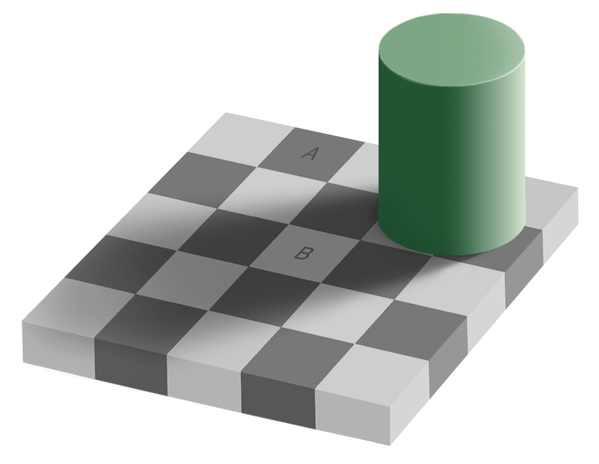

<!--
  %\VignetteIndexEntry{Einührungspräsentation}
  %\VignetteEngine{knitr::knitr}
  \usepackage[utf8]{inputenc}
-->


Gliederung
==============

## Inhaltsverzeichnis {.flexbox .vcenter}
- Empirische Sozialforschung
- Qualitativ vs. Quantitativ
- Eine Beispielstudie
- Seminarinhalte
- Formales zum Seminar

<div class="notes">
An dieser Stelle sollte vor allem die Motivation für eine qualifizierte Methodenausbildung erläutert werden: Nämlich (Vorläufige) Wege erarbeiten, die eine eigenständige Urteilsfindung bei politikwissenschaftlichen Sachverhalten und Streitfragen ermöglichen.
</div>

Ein Beispiel vorab
======================

## Sind weibliche Stürme tödlicher?
```{r Himicanes einlesen, echo=FALSE, warning=FALSE, message=FALSE}
library(gdata)
library(ggplot2)
library(Statistiklehre)
#library(mgcv)

# # Read in the data
# Data=read.xls("data/pnas.1402786111.sd01.xlsx", nrows=92, as.is=TRUE)
# Data$Category=factor(Data$Category)
# Data$Gender_MF=factor(Data$Gender_MF, labels = c('f', 'm'))
# #Data$ColourMF=c("lightblue", "pink")[as.numeric(Data$Gender_MF)]
# Data$ColourMF=c("blue", "red")[as.numeric(Data$Gender_MF)]
# BigH=which(Data$alldeaths>100) # Select hurricanes with > 100 deaths
# # scale the covariates
# Data$Minpressure.2014.sc=scale(Data$Minpressure_Updated.2014)
# Data$NDAM.sc=scale(Data$NDAM)
# Data$MasFem.sc=scale(Data$MasFem)
#data("himicanes")
```


```{r, echo=FALSE}
load("../data/himicanes.rda")
qplot(Year, alldeaths,  data=himicanes, color=Gender_MF, size=I(3))+ scale_colour_manual(values=c("blue", "red"))+scale_y_continuous(name="Gesamtzahl der Toten")+scale_x_continuous(name="Jahr")
# inputPanel(
#   selectInput("n_breaks", label = "Number of bins:",
#               choices = c(10, 20, 35, 50), selected = 20),
#   
#   sliderInput("bw_adjust", label = "Bandwidth adjustment:",
#               min = 0.2, max = 2, value = 1, step = 0.2)
# )
# 
# renderPlot({
#   hist(faithful$eruptions, probability = TRUE, breaks = as.numeric(input$n_breaks),
#        xlab = "Duration (minutes)", main = "Geyser eruption duration")
#   
#   dens <- density(faithful$eruptions, adjust = input$bw_adjust)
#   lines(dens, col = "blue")
# })
```
[@jung_female_2014]


# Empirische Sozialforschung
<div class="notes">
Zur ersten Sitzung (Tutorium?): Assessment mit Aufgaben aus Realschulabschluss- und Hauptschulabschlussklausuren!

Ergebnisses sind Assessment, gelten nicht als Test!
</div> 


## Wiederholung: Was ist empirische Forschung
- Empirie steht im Gegensatz zur "reinen Anschauung", zur Theorie.
- Empirische Sozialforschung bedeutet: Ein Bündel von Wegen zu haben, um wissenschaftliche Aussagen zu treffen
- Diese beziehen sich auf das, was mit Sinnen wahrnehmbar ist, jedoch sind sie nicht "subjektiv".
- Ziel: "Objektive" also nicht nur auf der persönlichen Meinung beruhende Aussagen aufgrund wahrnehmbarer Sachverhalte.
- D.h.: die Kriterien, nach denen etwas als "wahre" oder "falsche" Aussage beurteilt wird, sind offen gelegt und - innerhalb einer wissenschaftlichen "Sprechergemeinschaft" - anerkannt.

<div class="notes">
>- Subjektiv: nur für die eigenen Sinne plausibel. Gewissheit nur für sich selbst.-> Hier Feyerabend erwähnen?
>- Objektiv: (Vorläufige) Gewissheit, die auch von anderen geteilt wird, die wissenschaftliche Gewissheit anstreben.
>- Gewissheit ist hier (anders als bei Feyerabend) nicht religiös, weltanschaulich, ideologisch, sondern: vorläufig, mit angebbarer Vorgehensweise und Kriterien. 
-> Wissenschaftstheoretische Anklänge an Sprachpragmatismus (Peirce, Habermas), kritischen Rationalismus (Miller, Feyerabend), Immanuel Kant
</div> 

Qualitative vs. quantitative politikwissenschaftliche Forschung
========================================================


## Abgrenzung zur Theorie und aufgrund von Logik gewonnenen "wahren" Aussagen
- "Reine" Theorie: Aussagen werden durch Regeln der Logik ermittelt. 
- Aussagen gelten als wahr, wenn sie logisch wahr sind (nach Regeln der Logik gewonnen sind). 
- Logik ist dabei ein Regelsystem, durch das sichergestellt wird, dass Folgeaussagen wahr sind, wenn die ursprünglichen Annahmen wahr sind.
- Geltung erlangen theoretische Aussagen aufgrund von Logik nur im Kontext dieses Regelsystems.
- Der (durch eigenes Beobachten überprüfbare) Wahrheitsgehalt der Annahmen steht dabei nicht zur Diskussion.
- Empirische Forschung erfolgt dabei *auf der Grundlage* wahrnehmbarer Tatbestände, jedoch *nicht ohne Logik*.

## Logik und "reine Theorie"

- Formal logisch korrekt hergeleitete Aussagen sind immer wahr, da sie logisch wahr sind.
- Mit (formaler) Logik gewonnene Einsichten tragen zu neuen Erkenntnissen bei.
- Theoretisch aus "wahren" Annahmen hergeleitete Aussagen haben jedoch *keinen Informationswert*: Sie sagen nichts über die mit Sinnen wahrnehmbare "Welt" außerhalb der "Vorstellungswelt" der logischen Zusammenhänge aus.

## Abgrenzung qualitative und quantitative Sozialforschung I

### Qualitativ
- Qualitative Sozialforschung: Deutung von Sinnzusammenhängen, Verstehen von Inhalten und Sachverhalten.
- D.h. der *Sinn* steht im Zentrum der Forschung.
    - Sinn: z.B. die Frage: Was zeichnet die Polity-Struktur der Bundesrepublik Deutschland aus.
    - Verstehen von Konzepten (z.B.: was verstehen wir unter einem parlamentarischen System? Wie unterscheiden sich parlamentarische Politikmuster von präsidentiellen (politics)?)

## Abgrenzung qualitative und quantitative Sozialforschung II
### Quantitativ
- Quantitative Sozialforschung: Messen von Sachverhalten, Erklären von Tatsachen und Sachverhalten.
- D.h. die *Erklärung* steht im Zentrum der Forschung.
    - Deutung von Sachverhalten: (z.B. Wie viele parlamentarische Regierungsformen gibt es derzeit? Führen parlamentarische Systeme zu stabileren Regierungen als präsidentielle?)

<div class="notes">
Wiederholung aus dem letzten Semester
</div> 


## Theorie und Empirie
- Empirische Forschung trägt "Informationen" aus der "Welt" der durch die Sinne wahrnehmbaren Dinge zusammen.
- Vorgehensweise: beobachten, vergleichen, messen ...
- Aber: Was sinnlich wahrnehmbar ist, ist auch fehlerbehaftet - Man kann sich "täuschen"

## Wahrnehmung ist täuschbar
- Was wahrgenommen wird kann auch falsch sein!
siehe hier: A oder B - welches Schachfeld ist dunkler? 


## Wahrnehmung ist täuschbar
<div class="columns-2">


- Die grauen durchgezogenen Balken machen deutlich: Felder A und B haben den gleichen Grauwert!
- Im Kontext erscheint Feld B *im Schatten* des Zylinders und erzeugt *den Eindruck*, heller zu sein!
</div> 

## Wahrnehmung ist täuschbar


## Wahrnehmung kann Illusionen unterliegen

- Durch die Sehgewohnheiten im dreidimensionalen Raum wissen wir, dass Dinge im Schatten dunkler wirken, als die im Licht. 
- Das Formen und Farben der Abbildung können quantitativ vermessen werden:
    - Rautenmuster, Ovale und gerade Linien
    - Farben mit Farbverläufen, 
    - Gleiche "Farbwerte" für *Raute A* und *B* (physikalische Lichteigenschaften, quantifizierbar (Hex-Code #787878))
- Aber: die Deutung durch das menschliche Gehirn (aufgrund Erfahrung) gibt den Feldern *A* und *B* eine unterschiedliche Deutung 
    - es handelt sich um ein Schachbrett,
    - dunkles Feld im Licht vs. helles Feld im Schatten

## Gute empirische Forschung trägt zur "Ent-Täuschung" bei

- Alle Forschungsergebnisse gelten nur vorläufig.
- Es gibt keine "wahre" Theorie, sondern nur "gut erklärende" Theorien. 
- Gute Theorien können durch bessere ersetzt werden.
- Gute Forschung ist und bleibt in diesem Sinne skeptisch - ist aber nicht nihilistisch (maximal relativistisch).
<div class="notes">
In diesem Sinne kann auch ein weitreichender Methodenpluralismus gerechtfertigt werden.
</div> 

## Qualitativ: Beobachten, Befragen und Dokumentenanalyse mit der Fragestellung, wie ist ein Problem beschaffen
- Wie wird ein Problem wahrgenommen?
- wie wird ein Problem in Worte gefasst?
- In welchen (gesellschaftlichen) Kontexten lässt sich das Problem beschreiben?
- Wie wird innerhalb des Kontextes der Sinnzusammenhang von Problemen gedeutet?
<div class="notes">
Hier einen Link auf das Quiz aus dem letzten Semester einfügen
</div> 

## Quantitativ: Messen und Zählen mit unterschiedlichen Fragestellungen
- Worin besteht ein Problem, d.h. anhand welcher Merkmale lässt sich ein Problem beschreiben?
- Wie kann ein Problem erklärt werden, d.h. welche Merkmale tragen zur Erklärung bei?
- Welche Merkmalsausprägungen haben diese Merkmale?
- Wie verteilen sich die Merkmale unter den gemessenen Sachverhalten (Merkmalsträgern der Grundgesamtheit)?
- Wie hängen diese Merkmale miteinander zusammen?

<div class="notes">
>- Deutlich sollte werden: Was ein "Merkmal" ist, muss schon am Anfang der Forschung klar sein.
>- Ein Beobachtungsobjekt kann beliebig viele Merkmale haben, aber es bleibt bei einer abzählbaren Zahl von Merkmalen!!!
>- Ohne Kategorien von Merkmalen (qualitativ!) lässt sich keine Messung durchführen!

Suchen Sie Beispiele für Objekte und ihre Merkmale: Z.B. eine Schraube: Art (Holz- oder Metallschraube ..., Länge, Form des Gewindekopfes (Senkkopf oder Rundkopf, ...), Größe des Gewindekopfes, Material ...) 
</div> 

## Zusammenhang von quantitativer Forschung und Fachwissenschaft {.smaller}
<div class="columns-2">


- Quantitative Forschung verknüpft Fachwissenschaft (fachtheoretischer Rahmen), Untersuchungsweise (Methodik/Methodologie) und Statistik (mathematischer Theorierahmen)
- Begriff *Statistik* umfasst sowohl die mathematische Disziplin, als auch die ermittelten Ergebnisse, die in Form von "Statistiken" zusammengefasst werden.
- Eine Statistik ist eine Zahl oder mehrere Zahlen, die Verteilungen von Werten einer Variable in einer Reihe von Messwerten (verkürzt) zusammenfasst und eine Entscheidung ermöglicht. 
</div> 

<div class="notes">
>- Fachwissenschaft: Bestand an begrifflichen Kategorien, Kausalannahmen, Theorien, qualitativ und quantitativ gewonnenen Einsichten, die als vorläufig gültig angesehen werden und solche, die fraglich sind
>- Methodik: Bestand an anerkannten Arten, zu neuen Einsichten zu gelangen, so dass die Aussagen als gültig anerkannt werden.
>- Statistik: Hier verstanden im Sinne eines Teilbereichs der Stochastik als Subdisziplin mathematischer Hilfswissenschaft.

</div> 


## Verdeutlichung am Beispiel: Sind weibliche Stürme tödlicher als männliche?
<div class="notes">
Als gelungener Forschungsprozess soll gelten:
>- Übersetzung von fachwissenschaftlichem Wissen in eine Fragestellung. 
>- Übersetzung der Fragestellung in eine methodische Metasprache (aka kritischer Rationalismus) -> Identifizieren von Merkmalen und ermitteln einer angemessenen Untersuchungsanordnung. 
>- Übersetzen in Statistische Fachtermini (Variablen, Verteilungen, Stochastische Prozesse ...)
>- Rückübersetzung!
</div> 

- Beispiel einer guten wissenschaftlichen, methodisch eher kritisch zu bewertenden Studie
- Policy-Forschung "Katastrophenschutz"
- Frage: haben Hurricanes mit weiblichen Namen mehr Tote zur Folge als solche mit männlichen Namen?


## Ergebnis der Studie


<div class="notes">
Nach der Frage erst die Plausibilität diskutieren! Aus Alltagswissen und fachwissenschaftlicher Sicht sollte man skeptisch sein!
Danach: Diskussion der Ergebnisse. Klar machen: ist nur die erste Hälfte der Studie, Ziel: Experimentelle Untersuchung der (psychometrischen) Einstellungen / Theoretischen Annahmen zum Geschlecht der Hurricanes.
</div> 

## Die "Himicanes Studie" - warum sie wissenschaftlich vorbildlich ist

Vgl. [@jung_female_2014]
* Legt Daten offen
* Ist reproduzierbar und nachvollziehbar
* Macht eine wissenschaftliche Analyse wie aus dem Lehrbuch


## Die "Himicanes Studie" - warum sie methodisch problematisch ist

* Macht eine wissenschaftliche Analyse wie aus dem Lehrbuch für Experimente …
* … Ist aber eine sog. *Feldstudie*
* Die Feldstudie liefert ein (von den Forschern) gewünschtes Ergebnis …
* … die Darstellung endet, wo die Skepsis anfangen muss 

<div class="notes">
Darauf aufmerksam machen: Übersetzung der Frage in (methodisches) Studiendesign
Vorgehensweise bei der Auswertung der Statistik
</div> 

* Macht eine wissenschaftliche Analyse wie aus dem Lehrbuch für Experimente …
* … Ist aber eine sog. *Feldstudie*
* Die Feldstudie liefert ein (von den Forschern) gewünschtes Ergebnis …
* … die Darstellung endet, wo die Skepsis anfangen muss 

<div class="notes">
Darauf aufmerksam machen: Übersetzung der Frage in (methodisches) Studiendesign
Vorgehensweise bei der Auswertung der Statistik
</div> 


Seminarinhalte
=======================================================

## Sitzungsplan I

1. Sitzung: Einführung
1. Sitzung: Verteilungen und Histogramme
1. Sitzung: Deskriptive Statistik und Normalverteilung
1. Sitzung: Beobachtungsstudien und Experimente
1. Sitzung: Scatterplots und Korrelationen
1. Sitzung: Lineare Regression und Log-Transformation
1. Sitzung: Regressionseffekte, Fehlschlüsse und Kausalanalysen / Einführung in die Wahrscheinlichkeitstheorie

## Sitzungsplan 2 
- Sitzung 8: Wahrscheinlichkeit, zusammengesetzte Ereignisse / Formale Logik
- Sitzung 9: Wahrscheinlichkeit: Zentraler Grenzwertsatz
- Sitzung 10: Stichproben
- Sitzung 11: Konfidenzintervall / Hypothesen und Hypothesentest
- Sitzung 12: Inferenz, Likelihood und ihre Interpretation
- Sitzung 13: So lügt man mit Statistik / Wissenschaftskommunikation
- Sitzung 14: Klausur


Formales zum Seminar
========================================================

## Seminaranforderungen
- Bestehen der 80% der Tests
- Durchführen von Übungs Aufgaben im Rahmen von Beispielen

## Klausur
- Modulabschluss: Klausur (90 Min)
- Antwortwahlverfahren und Ergebnisse (Werte und Worte). 
- Gezählt wird nur der Antwortbogen!

# Literatur
## Literaturhinweise